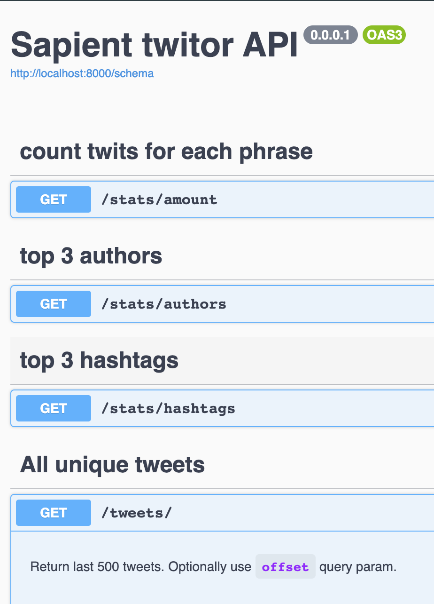
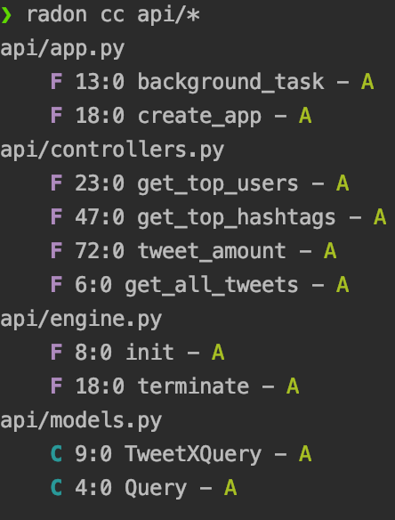

# sapient twitor 

**architecture details:** 
*Starlette* framework app, *gino* orm, *postgres* db, uvicorn

####Requirements: 

docker --version  
`Docker version 19.03.5, build 633a0ea`  
docker-compose --version  
`docker-compose version 1.25.4, build 8d51620a`
-------------
#### How to run:
- set `TWITTER_CONSUMER_KEY` and `TWITTER_CONSUMER_SECRET` in file `api.env`
- (optionally) set other env vars in file `api.env`  
- docker-compose up

By default app fetches 1000 records from twitter once in 10 sec.

 schema (for swagger) -  
 http://localhost:8000/schema

To peck the api with your own hands:
- http://localhost:8000/stats/amount 
- http://localhost:8000/stats/authors
- http://localhost:8000/stats/hashtags
- http://localhost:8000/tweets/
- http://localhost:8000/tweets/100

-------------

Notes:

 Made `tweet_query` table slightly denormalized - with composite key `tweet.id, tweet.q`(q=query)
 instead of making separate table `tweet` and `tweet_x_query` to get rid of redundant joins.  
 Think about `query` as "tenant", entities of which have minimal(but possible) intersection.

Prefer to raise independent periodic background tasks separately from api microservice but ...it`s 23:20 and I not even touched tests :)

-------------
**TODO:**
- tests
- linter
- fetch {by given period}
- postgres bulk insert
- deploy with nginx
- Redis cache (especially for select distinct tweets part)

   

